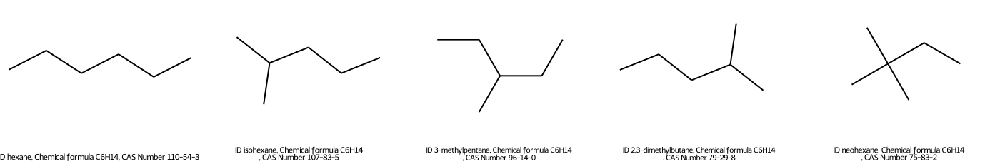

<h1 align="center">
<p>:art: SMILES2Image
</h1>

<h3 align="center">
<p>Generate SMILES image files; Base on RDKit.
</h3>



## Prerequisites
* `python` >= 3.7
* `rdkit`
* `pandas`

## Usage
```
smi2img -i smiles.csv -o figure.png -vv --sort -n 49 -row 7
```
If you want to draw more than 50 molecules, multiple files with a maximum of 50 molecules are created for each image. The maximum number for each image can be adjusted through -max up to 50 possible.

50개 이상의 분자를 그리려면 각 이미지에 최대 50개의 분자가 있는 여러 파일이 생성됩니다. 각 이미지의 최대 개수는 `-max`로 조정이 됩니다.

```
# High resolution
smi2img -i smiles.csv -o figure.svg -vv --sort -n 49 -row 7
inkscape -d 150 figure.svg -o figure.pdf
```

## Arguments
* `-i, --input`: SMILES file
* `-S, --smiles`: SMILES list (Not yet supported)
* `-o, --output`: Output file name and format (`.png`|`.svg`)
* `-n, --ntop`: The total number of molecules displayed in the figures (default: 10)
* `-row, --mols-per-row`: The number of molecules per row (default: 5)
* `-sort, --sort`: Sort is performed on the columns to be defined or to be determined.
* `-max, --max-per-img`: The number of molecules per image (maximum 50)
* `-R, --reverse`: Reverse sorting
* `--size`: `(N N)`, The size of figure of each molecule (default: L 280 * H 230)
* `-v, --verbosity`: Increase output verbosity. `-v`: Print head of input, `-vv`: Set labels(legends).

## Reference
* [MolsToGridImage](https://www.rdkit.org/docs/source/rdkit.Chem.Draw.html#rdkit.Chem.Draw.MolsToGridImage)